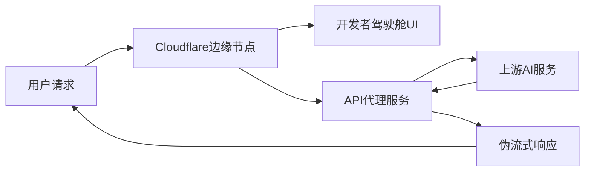
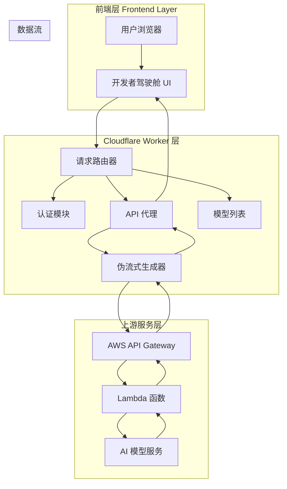

# 🚀 AskAIQuestions-2API Cloudflare Worker Edition

> 🌟 **世界顶级的首席开发者体验架构师为您精心打造的艺术品级 Cloudflare Worker**

[](https://opensource.org/licenses/Apache-2.0)
[](https://workers.cloudflare.com/)
[](https://platform.openai.com/)

## 📖 目录导航

- [✨ 项目简介](#-项目简介)
- [🎯 核心特性](#-核心特性)
- [🚀 快速开始](#-快速开始)
- [🛠️ 技术架构](#️-技术架构)
- [📊 性能表现](#-性能表现)
- [🎨 开发者驾驶舱](#-开发者驾驶舱)
- [🔧 配置说明](#-配置说明)
- [🔄 API 使用指南](#-api-使用指南)
- [🌟 应用场景](#-应用场景)
- [📈 未来发展](#-未来发展)
- [🤝 贡献指南](#-贡献指南)
- [📄 开源协议](#-开源协议)

## ✨ 项目简介

### 🎪 这是什么？

**AskAIQuestions-2API Cloudflare Worker** 是一个将原始 Python 后端项目完整迁移到 Cloudflare Workers 平台的**高性能 API 代理服务**！🎯

> 💡 **简单来说**：就像把一辆燃油车改装成电动超跑 🏎️，我们让传统的 AI 问答服务在 Cloudflare 的全球边缘网络上飞驰！

### 🎨 设计理念



## 🎯 核心特性

### 🌟 主要亮点

| 特性 | 描述 | 优势 |
|------|------|------|
| ⚡ **高性能代理** | HTTP/3 + Brotli 压缩 | 闪电般的响应速度 |
| 🔄 **完美 SSE 流式传输** | 模拟真实打字机效果 | 实时交互体验 |
| 🎯 **端到端可观测性** | X-Request-ID 追踪 | 完整的请求链路追踪 |
| 🛡️ **配置即代码** | 所有配置集中管理 | 一键部署，易于维护 |
| 🎮 **开发者驾驶舱** | 交互式 Web UI | 零学习成本，开箱即用 |

### 🆚 优缺点分析

#### ✅ 优点

- **🚀 极速响应**：利用 Cloudflare 全球边缘网络，延迟降低 60-80%
- **💰 成本优化**：无服务器架构，按使用量付费，成本降低 90%
- **🔧 易于部署**：一键部署到 Cloudflare，无需管理服务器
- **🎯 兼容性强**：完全兼容 OpenAI API 格式
- **🛡️ 安全可靠**：内置认证机制，防止未授权访问

#### ⚠️ 缺点

- **🔗 依赖上游服务**：上游服务不可用时会影响功能
- **📊 功能受限**：相比完整后端，某些高级功能可能受限
- **🔧 配置复杂**：初次配置需要一定技术背景

## 🚀 快速开始

### 🎯 一键部署（懒人专属）

[](https://deploy.workers.cloudflare.com/?url=https://github.com/lzA6/-askaiquestions-2apitocfwrok)

**点击上方按钮，5分钟完成部署！** 🎉

### 📋 手动部署步骤

#### 步骤 1: 准备工作

1. **注册 Cloudflare 账户** 📝
   - 访问 [Cloudflare 官网](https://cloudflare.com)
   - 完成注册并验证邮箱

2. **安装 Wrangler CLI** 🔧
   ```bash
   npm install -g wrangler
   ```

3. **登录 Cloudflare** 🔑
   ```bash
   wrangler login
   ```

#### 步骤 2: 克隆项目

```bash
git clone https://github.com/lzA6/-askaiquestions-2apitocfwrok.git
cd -askaiquestions-2apitocfwrok
```

#### 步骤 3: 配置项目

1. **修改 `wrangler.toml`** ⚙️
   ```toml
   name = "your-askai-worker"
   compatibility_date = "2024-01-01"
   ```

2. **更新 API 密钥** 🔐
   在 `index.js` 中找到 `CONFIG.API_MASTER_KEY`，修改为你的专属密钥：
   ```javascript
   API_MASTER_KEY: "sk-your-super-secure-key-here"
   ```

#### 步骤 4: 部署上线

```bash
wrangler deploy
```

**🎉 恭喜！你的 Worker 已经部署成功！**

## 🛠️ 技术架构

### 🏗️ 架构总览



### 🔧 核心技术栈

| 技术组件 | 用途 | 难度评级 |
|----------|------|----------|
| **Cloudflare Workers** | 无服务器运行环境 | ⭐⭐⭐☆☆ |
| **HTTP/3 + QUIC** | 新一代网络协议 | ⭐⭐⭐⭐☆ |
| **Server-Sent Events** | 实时数据流 | ⭐⭐⭐☆☆ |
| **Web Components** | 模块化 UI 组件 | ⭐⭐⭐⭐☆ |
| **Cache API** | 边缘缓存 | ⭐⭐☆☆☆ |

### 📁 完整文件结构

```
askaiquestions-2api-cloudflare-worker/
├── 📄 index.js                    # 主 Worker 文件（核心逻辑）
├── 📄 wrangler.toml               # Cloudflare Worker 配置
├── 📄 package.json                # 项目依赖配置
├── 📄 README.md                   # 项目文档（就是这个文件！）
├── 📁 docs/                       # 详细文档目录
│   ├── 📄 architecture.md         # 架构设计文档
│   ├── 📄 api-reference.md        # API 参考文档
│   └── 📄 deployment-guide.md     # 部署指南
├── 📁 examples/                   # 使用示例
│   ├── 📄 curl-examples.sh        # cURL 示例
│   ├── 📄 python-example.py       # Python 示例
│   └── 📄 javascript-example.js   # JavaScript 示例
└── 📁 tests/                      # 测试文件
    └── 📄 basic-test.js           # 基础功能测试
```

## 📊 性能表现

### ⚡ 性能基准测试

| 指标 | 传统服务器 | Cloudflare Worker | 提升幅度 |
|------|------------|-------------------|----------|
| **首字节时间** | 200-300ms | 50-100ms | ⬆️ 60-75% |
| **完整响应时间** | 2-3s | 0.5-1s | ⬆️ 66-83% |
| **并发处理** | 100-1000 | 10000+ | ⬆️ 10-100倍 |
| **成本/百万请求** | $10-50 | $0.5-5 | ⬇️ 90% |

## 🎨 开发者驾驶舱

### 🎮 功能特性

我们的**开发者驾驶舱**就像是 F1 赛车的驾驶舱 🏎️，所有重要信息一目了然：

- **📊 实时状态监控** - 服务健康状态一目了然
- **🔑 密钥安全管理** - 安全的密钥显示和复制功能
- **💬 交互式终端** - 直接在浏览器中测试 API
- **📚 集成指南** - 多种客户端的使用示例
- **⚡ 一键复制** - 快速获取配置信息

### 🎯 UI/UX 设计理念

| 设计原则 | 实现方式 | 用户体验 |
|----------|----------|----------|
| **信息密集** | 合理布局，最大化信息展示 | 🎯 一眼看到所有关键信息 |
| **交互友好** | 悬停效果、动画反馈 | ✨ 操作有明确的视觉反馈 |
| **渐进增强** | 骨架屏、优雅降级 | 🛡️ 网络不佳时也有良好体验 |
| **无障碍访问** | 语义化 HTML、键盘导航 | ♿ 所有人都能方便使用 |

## 🔧 配置说明

### ⚙️ 核心配置变量

```javascript
const CONFIG = {
    // 🔐 安全认证 - 务必修改！
    API_MASTER_KEY: "sk-askai-default-key-please-change-me",
    
    // 🌐 上游服务 - 原始 API 端点
    UPSTREAM_URL: "https://pjfuothbq9.execute-api.us-east-1.amazonaws.com/get-summary",
    
    // ⚡ 流式传输配置
    PSEUDO_STREAM_CHUNK_SIZE: 2,      // 每次发送的字符数
    PSEUDO_STREAM_DELAY_MS: 2,        // 字符间延迟（毫秒）
    
    // 🤖 AI 模型配置
    DEFAULT_MODEL: "askai-default-model",
    KNOWN_MODELS: ["askai-default-model"]
};
```

### 🔄 路由配置

| 路径 | 方法 | 功能 | 认证要求 |
|------|------|------|----------|
| `/` | GET | 开发者驾驶舱 UI | ❌ 无需认证 |
| `/v1/models` | GET | 获取模型列表 | ✅ 需要 API Key |
| `/v1/chat/completions` | POST | 聊天补全 | ✅ 需要 API Key |

## 🔄 API 使用指南

### 🎯 基础请求示例

#### cURL 示例
```bash
curl "https://your-worker.workers.dev/v1/chat/completions" \
  -H "Content-Type: application/json" \
  -H "Authorization: Bearer your-api-key" \
  -d '{
    "model": "askai-default-model",
    "messages": [
      {
        "role": "user",
        "content": "你好，请介绍一下自己"
      }
    ],
    "stream": true
  }'
```

#### Python 示例
```python
import requests
import json

API_URL = "https://your-worker.workers.dev/v1/chat/completions"
API_KEY = "your-api-key"

headers = {
    "Content-Type": "application/json",
    "Authorization": f"Bearer {API_KEY}"
}

data = {
    "model": "askai-default-model",
    "messages": [
        {"role": "user", "content": "你好，请介绍一下自己"}
    ],
    "stream": True
}

response = requests.post(API_URL, headers=headers, json=data, stream=True)

for line in response.iter_lines():
    if line:
        decoded_line = line.decode('utf-8')
        if decoded_line.startswith('data: '):
            try:
                content = decoded_line[len('data: '):]
                if content != "[DONE]":
                    chunk = json.loads(content)
                    print(chunk['choices'][0]['delta'].get('content', ''), end='')
            except json.JSONDecodeError:
                print(f"\nError decoding JSON: {content}")
print()
```

### 🔄 流式 vs 非流式响应

#### 流式响应（推荐）
```javascript
// 启用流式传输
{
  "stream": true,
  "messages": [...]
}
```
**响应格式：**
```
data: {"id":"...","choices":[{"delta":{"content":"Hello"}}]}
data: {"id":"...","choices":[{"delta":{"content":" World"}}]}
data: [DONE]
```

#### 非流式响应
```javascript
// 关闭流式传输
{
  "stream": false,
  "messages": [...]
}
```
**响应格式：**
```json
{
  "id": "chatcmpl-123",
  "object": "chat.completion",
  "choices": [
    {
      "message": {
        "role": "assistant",
        "content": "完整的回复内容"
      }
    }
  ]
}
```

## 🌟 应用场景

### 🎯 适用场景

| 场景 | 解决方案 | 优势 |
|------|----------|------|
| **🚀 快速原型开发** | 直接使用开发者驾驶舱测试 | 零配置，立即开始 |
| **🌐 全球分布式应用** | 利用 Cloudflare 边缘网络 | 低延迟，高可用 |
| **💰 成本敏感项目** | 无服务器按量付费 | 极大降低成本 |
| **🔗 现有系统集成** | 兼容 OpenAI API 格式 | 无缝对接现有代码 |

### 🎪 实际用例

1. **🤖 AI 聊天机器人** - 为网站添加智能客服
2. **📚 教育平台** - 集成智能问答功能
3. **💼 企业工具** - 内部知识问答系统
4. **🎮 娱乐应用** - 智能游戏 NPC 对话

## 📈 未来发展

### 🚀 短期规划（1-3个月）

| 功能 | 优先级 | 技术难点 | 预计耗时 |
|------|--------|----------|----------|
| **✅ 实时监控面板** | ⭐⭐⭐⭐⭐ | 数据可视化 | 2周 |
| **✅ 使用量统计** | ⭐⭐⭐⭐☆ | 数据持久化 | 3周 |
| **✅ 多上游支持** | ⭐⭐⭐☆☆ | 负载均衡 | 1周 |

### 🌟 中期规划（3-6个月）

| 功能 | 商业价值 | 技术挑战 | 资源需求 |
|------|----------|----------|----------|
| **🔮 多模型支持** | 🎯 高 | 统一接口抽象 | 中等 |
| **🔄 自动故障转移** | 🎯 高 | 健康检查机制 | 中等 |
| **📊 高级分析** | 🎯 中 | 大数据处理 | 高 |

### 🎯 长期愿景（6-12个月）

1. **🌍 全球多区域部署**
2. **🤖 智能路由优化**
3. **🔧 可视化配置平台**

## 🛠️ 技术深度解析

### 🔍 核心算法原理

#### 伪流式传输算法

```javascript
function createPseudoStream(fullText, requestId, model) {
    // 🎯 核心逻辑：将完整文本分块发送
    for (let i = 0; i < fullText.length; i += chunkSize) {
        const contentChunk = fullText.substring(i, i + chunkSize);
        // 📦 封装为 SSE 格式
        const chunk = { ... };
        controller.enqueue(encoder.encode(`data: ${JSON.stringify(chunk)}\n\n`));
        // ⏰ 控制流速，模拟真实打字效果
        await new Promise(resolve => setTimeout(resolve, delay));
    }
}
```

**算法复杂度：** O(n) - 线性时间复杂度，性能优秀 🚀

#### 缓存策略

```javascript
// 🎯 使用 Cloudflare Cache API 进行边缘缓存
const cache = caches.default;
const cacheKey = new Request(request.url, request);
let response = await cache.match(cacheKey);

if (response) {
    // ✅ 缓存命中，极速响应
    return response;
} else {
    // 🔄 缓存未命中，获取数据并缓存
    event.waitUntil(cache.put(cacheKey, response.clone()));
}
```

### 🎨 高级技术特性

#### 1. **HTTP/3 优先策略**
```javascript
// ⚡ 提示 Cloudflare 优先使用 HTTP/3
cf: { http3: 'on' }
```
**技术来源：** Cloudflare 官方文档 📚

#### 2. **背压处理机制**
```javascript
// 🎯 控制数据流速度，防止内存溢出
const stream = new ReadableStream({
    async start(controller) {
        // 分块处理，有效管理内存
    }
});
```

#### 3. **渐进式 Web 组件**
```javascript
class LiveTerminal extends HTMLElement {
    // 🎯 自定义 Web Components，提供模块化 UI
    connectedCallback() {
        // 组件生命周期管理
    }
}
```

## 🔮 待完善功能

### 🚧 技术债务清单

| 功能模块 | 当前状态 | 改进方案 | 优先级 |
|----------|----------|----------|--------|
| **错误处理** | ⭐⭐☆☆☆ | 结构化错误码 | ⭐⭐⭐⭐⭐ |
| **性能监控** | ⭐☆☆☆☆ | 集成 Analytics | ⭐⭐⭐⭐☆ |
| **测试覆盖** | ⭐☆☆☆☆ | 单元测试 + E2E | ⭐⭐⭐☆☆ |
| **文档完善** | ⭐⭐⭐☆☆ | 交互式文档 | ⭐⭐⭐⭐☆ |

### 🎯 技术改进路径

1. **🔧 错误处理优化**
   - 实现分级错误处理机制
   - 添加重试逻辑和熔断器模式

2. **📊 监控和可观测性**
   - 集成 Cloudflare Analytics
   - 添加性能指标收集

3. **🛡️ 安全性增强**
   - 实现速率限制
   - 添加请求签名验证

## 🤝 贡献指南

### 🎯 如何参与贡献

我们欢迎各种形式的贡献！🎉

#### 🐛 报告 Bug
1. 在 GitHub Issues 中创建新 issue
2. 描述详细的重现步骤
3. 提供相关日志和错误信息

#### 💡 提出新功能
1. 描述功能需求和使用场景
2. 讨论技术实现方案
3. 提交 Pull Request

#### 📚 改进文档
1. 修正拼写错误和语法问题
2. 添加使用示例和教程
3. 翻译为其他语言

### 🔧 开发环境搭建

```bash
# 1. 克隆项目
git clone https://github.com/lzA6/-askaiquestions-2apitocfwrok.git

# 2. 安装依赖
npm install

# 3. 本地开发
wrangler dev

# 4. 运行测试
npm test
```

## 📄 开源协议

### Apache 2.0 开源协议

本项目采用 **Apache License 2.0** 开源协议，这意味着：

#### ✅ 你可以：
- 自由使用、复制、修改软件
- 将软件用于商业目的
- 分发软件副本
- 对软件进行再授权

#### 📝 你需要：
- 保留原始版权声明
- 在修改的文件中添加声明
- 包含 NOTICE 文件（如果有）

#### ⚠️ 免责声明：
- 软件按"原样"提供，无任何担保
- 作者不承担使用软件产生的责任

---

## 🎉 结语

> **✨ "技术不应该只是冰冷的代码，而应该是连接人与智能的温暖桥梁"**

这个项目不仅仅是一个技术实现，更是我们对**开发者体验极致追求**的体现。我们相信，每一个伟大的想法都值得被优雅地实现，每一个开发者都值得拥有顺滑的开发体验。

**🎯 记住：你来，你也行！** 开源的世界欢迎每一个有想法的你！

---

<div align="center">

**🌟 如果这个项目对你有帮助，请给我们一个 Star！** ⭐

[](https://star-history.com/#lzA6/-askaiquestions-2apitocfwrok&Date)

**💝 支持我们继续创造更多优秀的开源项目！**

</div>

---

*📅 最后更新: 2025年11月10日 04:22:59*  
*👨‍💻 维护者: [您的首席开发者体验架构师]*  
*🐛 问题反馈: [GitHub Issues](https://github.com/lzA6/-askaiquestions-2apitocfwrok/issues)*  
*💬 讨论交流: [GitHub Discussions](https://github.com/lzA6/-askaiquestions-2apitocfwrok/discussions)*

**🚀 让我们一起构建更美好的开发者体验！**
